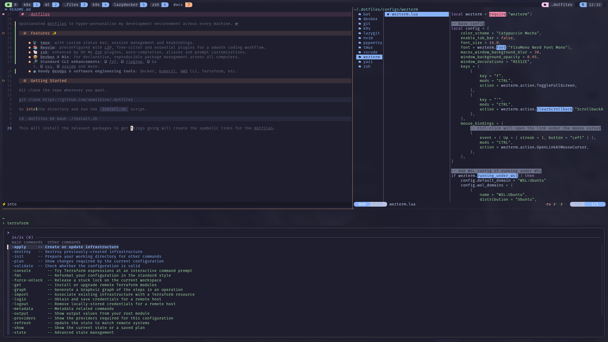

# 🛠️.dotfiles

Opinionated dotfiles to hyper-personalise my development environment across every machine.



## ✨ Features

- 🖥️ **tmux**: with custom status bar, session management and keybindings.
- 📚 **Neovim**: preconfigured with LSP, Tree-sitter and essential plugins for a smooth coding workflow.
- 🐚 **zsh**: enhanced by Oh My Zsh plugins, auto-completion, aliases and prompt customisations.
- 📦 **Devbox & Nix**: for declarative, reproducible package management across all computers.
- 🔎 **Standard CLI enhancements**: [fzf](https://github.com/junegunn/fzf), [ripgrep](https://github.com/BurntSushi/ripgrep), [bat](https://github.com/sharkdp/bat), [exa](https://github.com/ogham/exa), [zoxide](https://github.com/ajeetdsouza/zoxide) and more.
- ⚙️**Handy DevOps & software engineering tools**: Docker, kubectl, AWS CLI, Terraform, etc.

## 🏃Getting Started

Git clone the repo wherever you want.

```bash
git clone https://github.com/okwilkins/.dotfiles
```

Go into the directory and run the `install.sh` script.

```bash
cd .dotfiles && bash ./install.sh
```

This will install the relevant packages to get things going will create the symbolic links for the dotfiles.

## 🙏 Thanks To

A big thank you to the following people for their inspiration and help:

- [ThePrimeagen](https://github.com/ThePrimeagen)
- [Phantas0s](https://github.com/Phantas0s)
- [omerxx](https://github.com/omerxx)
- [vfarcic](https://github.com/vfarcic)
- [elliotminns](https://github.com/elliottminns)
- [vl-cr](https://github.com/vl-cr)

